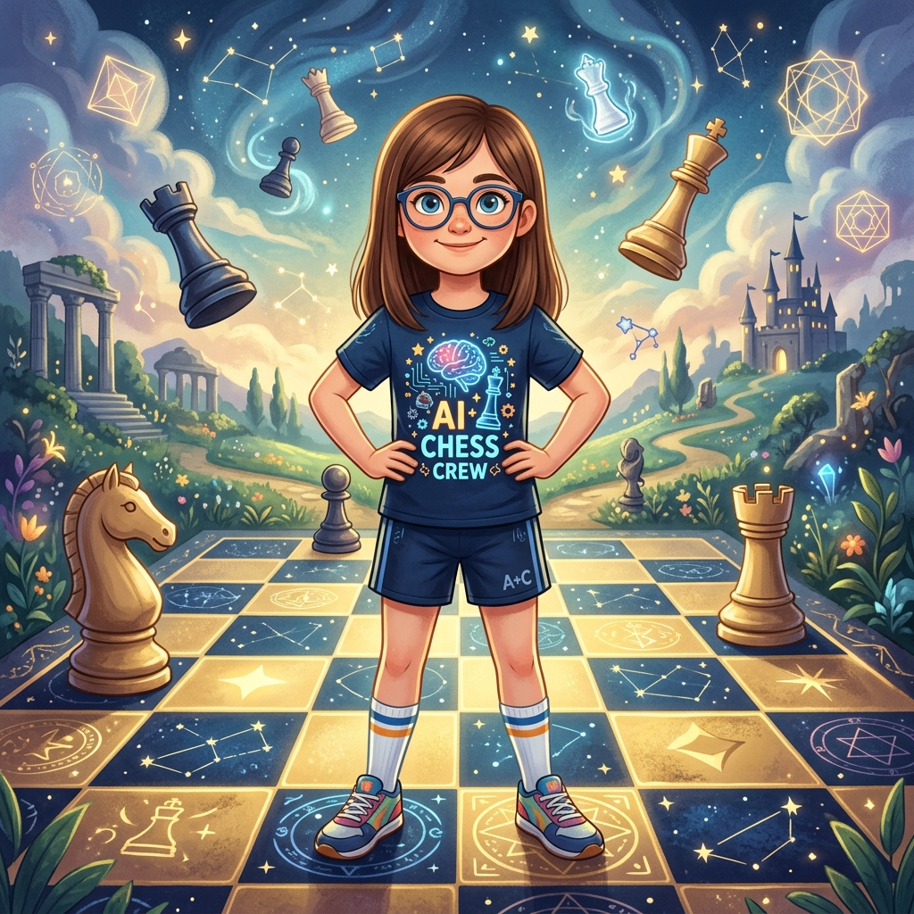
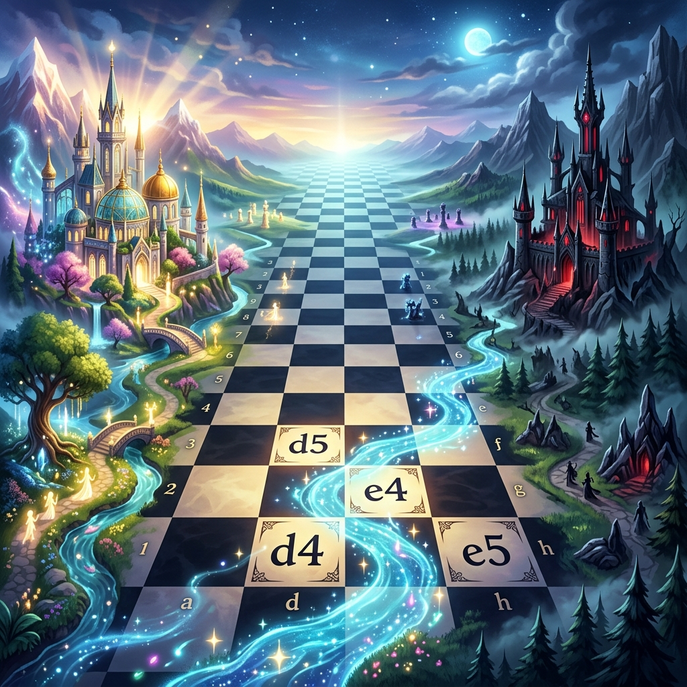
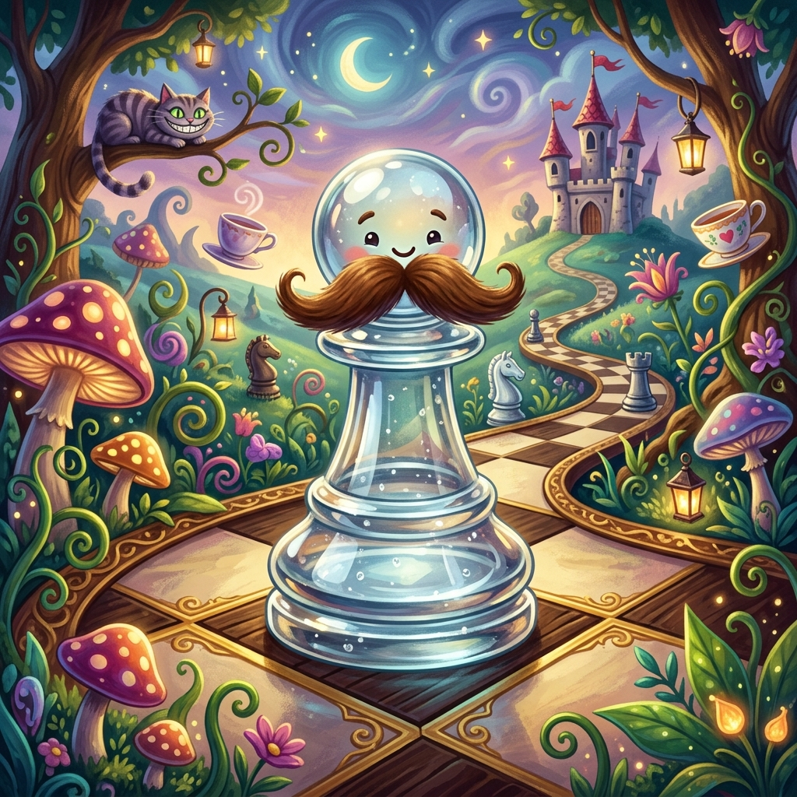
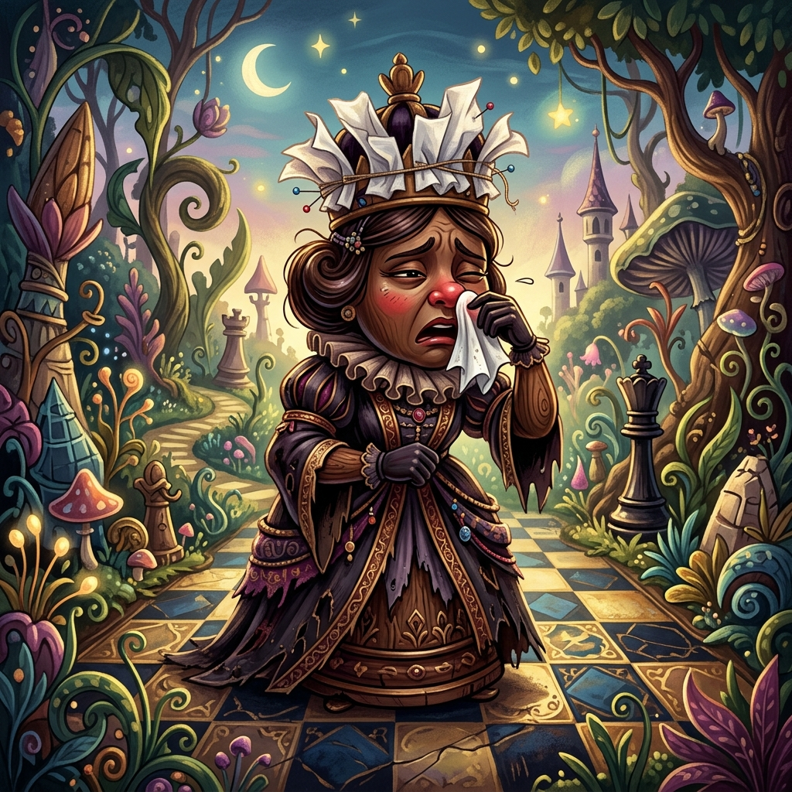
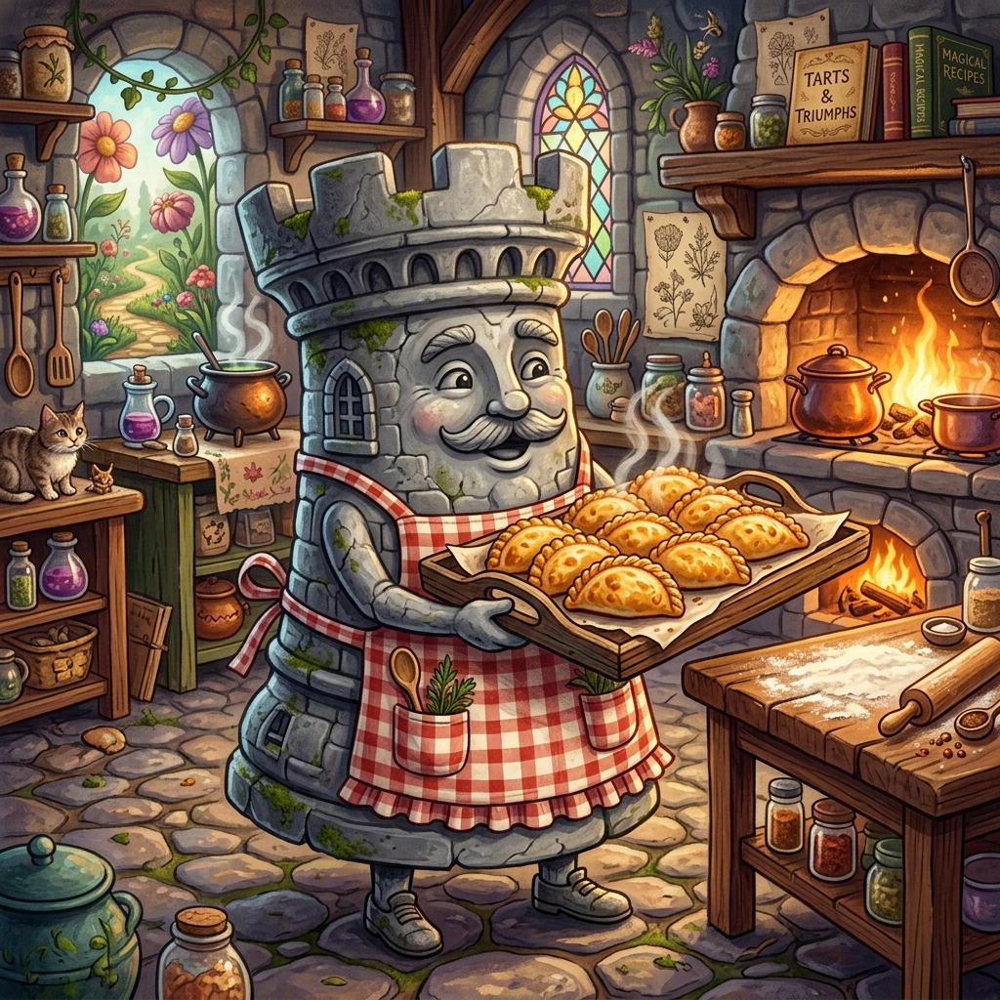
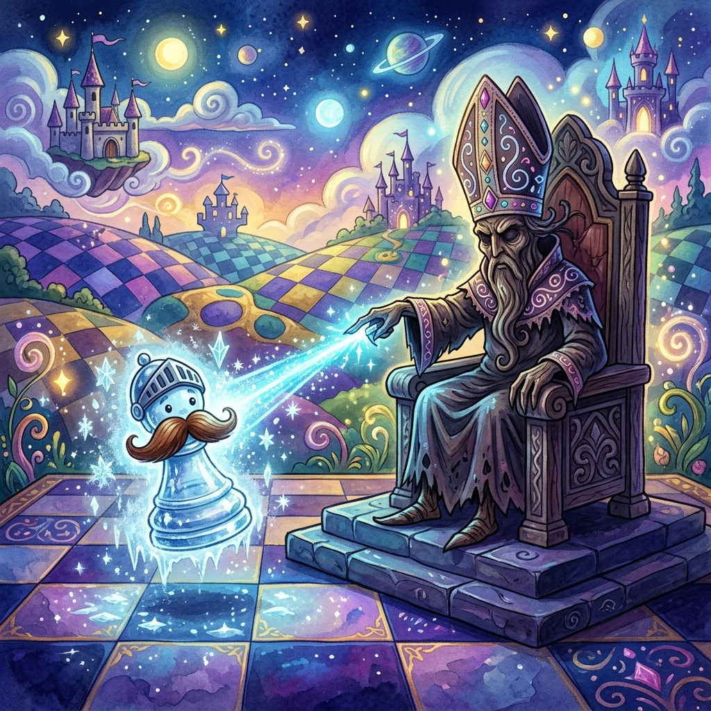
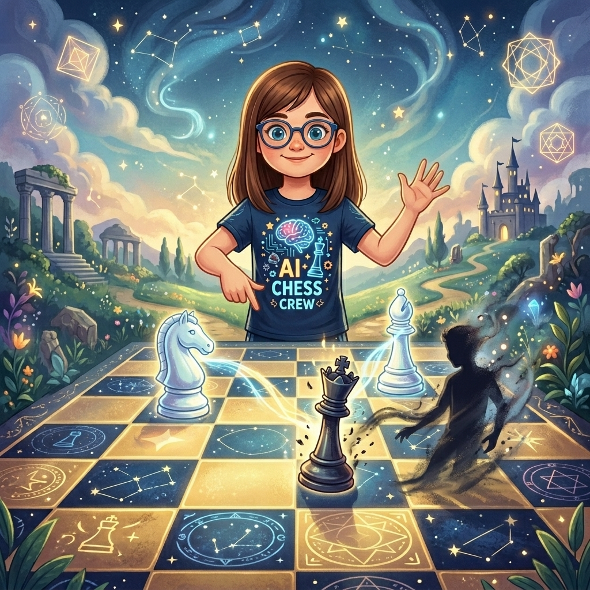

<p align="center">
  
</p>

<h1 align="center">♕ Martina</h1>
<h3 align="center">Cuentos de ajedrez para dormir</h3>

<p align="center">
  <a href="https://martinachess.com"><strong>🌐 Visitar sitio web</strong></a>
</p>

<p align="center">
  
  
  
  
</p>

---

<p align="center">
  <strong>¿Tu hija juega ajedrez?</strong> Bienvenida al club. Aquí encontrarás aventuras donde reinos mágicos, piezas parlanchinas y rivales tramposos se mezclan con <em>aperturas reales, tácticas y finales de torneo</em>. Todo escrito para leerse en voz alta antes de dormir.
</p>

---

## ✨ ¿Qué es esto?

Una colección de cuentos infantiles ilustrados que **enseñan ajedrez de verdad** con el tono surrealista de *Alicia en el país de las maravillas* y la magia de hablarle a un tablero como si estuviera vivo.

Cada noche, al cerrar los ojos, Martina despierta en el **Reino de las Sesenta y Cuatro Casillas**: un tablero infinito donde las piezas tienen personalidad, los peones llevan bigotes falsos y una Reina Negra es alérgica al jaque mate.

Pero no todo es magia. Los cuentos alternan con el **mundo real** del ajedrez competitivo: torneos escolares, rivales tramposos, blitz bajo presión, preparación de aperturas la noche anterior. Porque perder también enseña. Y volver al día siguiente, más todavía.

<p align="center">
  
</p>

## 🎭 Personajes

| Pieza | Nombre | Locura |
|-------|--------|--------|
| ♟️ | **Peoncito** | Peón de cristal con bigote falso que se le despega. Sueña con llegar a la octava fila. |
| ♜ | **Torreta** | Torre de piedra con delantal. Vende empanadas temáticas en la casilla c3. |
| ♛ | **Reina Negra** | Alérgica al jaque mate. Prohibió el mate con un certificado médico falso. |
| ♞ | **Caballo de Ŋ** | Salta en L, pero a veces se confunde y salta en Ŋ. Orgullo lesionado. |
| ♝ | **Alfil Exiliado** | Lo mandaron a una diagonal de un solo color. Ahora reinventa la geometría. |
| ♔ | **Rey Blanco** | 800 años sin salir de su castillo. Necesita clases de caminata. |
| 👤 | **La Sombra** | Tuerce reglas, estornuda de mentira, mueve piezas. Pero a veces solo quiere compañía. |

<p align="center">
  
  
  
</p>

## 📚 Cuentos

| # | Mundo | Título | ¿Qué enseña? |
|---|-------|--------|--------------|
| 1 | 🌙 Mágico | El Primer Movimiento | Centro, desarrollo, sacrificio de alfil (Greco), Apertura Italiana |
| 2 | ☀️ Real | Tic, Tac, Jaque Mate | Manejo de reloj, nervios de torneo, Mate de Boden |
| 3 | 🌙 Mágico | La Clavada del Alfil Exiliado | Clavada, pieza sobrecargada (Morphy Opera Game) |
| 4 | ☀️ Real | El Caballo Salvaje | Puesto avanzado del caballo (Smyslov vs Rudakovsky) |
| 5 | 🌙 Mágico | La Coronación de Peoncito | Peón pasado, coronación y subcoronación |
| 6 | ☀️ Real | La Jugada Invisible | Preparación de aperturas, estudio del rival |
| 7 | 🌙 Mágico | El Pescador y el Elegante | Zugzwang, oposición en finales (Fischer vs Spassky) |
| 8 | ☀️ Real | El Relámpago y el Vikingo | Blitz, instinto vs cálculo (Niemann vs Carlsen) |
| 9 | 🌙 Mágico | La Sombra que Jugaba | Sacrificio, iniciativa, juego limpio (Anderssen, La Inmortal) |
| 10 | ☀️ Real | Lo Que No Se Ve en el Tablero | Frustración, trampas reales, resiliencia |
| 11 | 🌙 Mágico | La Última Grieta | Triangulación, finales de rey activo |
| 12 | ☀️ Real | El Peón que Bailaba | Peón aislado, confianza, enseñar a otros |

<p align="center">
  <a href="https://martinachess.com"><strong>📖 Leer todos los cuentos →</strong></a>
</p>

## 💡 Lo que tu hija va a aprender

No es un libro de texto. Es un libro de aventuras donde los conceptos aparecen porque la historia los necesita, no porque toque enseñarlos.

Pero al terminar los 12 cuentos, sabrá:

- ✔️ Apertura Italiana, Defensa Siciliana, Gambito de Dama
- ✔️ Clavada, desviación, pieza sobrecargada, sacrificio
- ✔️ Zugzwang, oposición, triangulación, regla del cuadrado
- ✔️ Manejo del reloj, nervios, preparación pre-torneo
- ✔️ Cómo perder, levantarse y volver al día siguiente

## 🎨 Galería

Todas las ilustraciones —39 imágenes generadas con IA— están disponibles en la galería del sitio. Cada una retrata un momento clave de algún cuento: desde Peoncito mirando con orgullo la octava fila hasta la Sombra aceptando chocolate caliente en el castillo del Rey Blanco.

<p align="center">
  
  
</p>

<p align="center">
  <a href="https://martinachess.com/galeria.html"><strong>🖼️ Ver galería completa →</strong></a>
</p>

## 🧠 Filosofía del proyecto

> «El ajedrez no se acaba cuando pierdes. Se acaba cuando dejas de luchar.»

Estos cuentos son para niños. Pero no los tratan como tontos. Aquí:

- ✅ Se puede perder, frustrarse y llorar. Lo importante es volver.
- ✅ Existen tramposos y a veces ganan. No hay que normalizarlos, pero sí aprender a lidiar con ellos.
- ✅ Jugar suave por lástima es **faltarle el respeto** al rival. Siempre se da el 100%.
- ✅ Martina nunca se victimiza, nunca hace trampa, nunca abandona. Pero sí aprende, pierde y se levanta.

## 👑 Ídolos de Martina

<p align="center">
  <strong>Judith Polgar</strong> — precisión quirúrgica, ataque calculado, rompió todas las barreras<br>
  <strong>Mikhail Tal</strong> — el mago de Riga, llevar al rival a un bosque oscuro donde 2+2=5
</p>

## 🛠️ Cómo funciona

HTML estático. CSS vanilla. JavaScript mínimo. No hay frameworks, no hay dependencias, no hay build step. Abre `index.html` y funciona.

```bash
# Opcional: servidor local para desarrollo
python3 -m http.server 8000
```

## 📄 Licencia

Este proyecto tiene **doble licencia**:

- **Código** (HTML, CSS, JS) → [MIT](LICENSE)
- **Contenido** (cuentos, ilustraciones) → [Creative Commons BY-NC 4.0](https://creativecommons.org/licenses/by-nc/4.0/deed.es)

> ⚠️ Prohibida la monetización o uso comercial del contenido sin permiso explícito del autor.

---

<p align="center">
  <sub>Historias originales para Martina, por papá · «El ajedrez es un cuento de hadas de la mente» — Mikhail Tal</sub>
</p>
